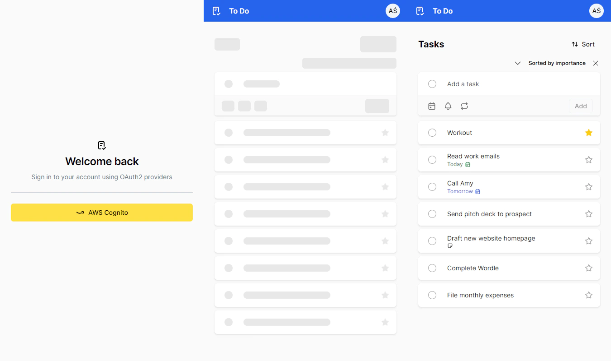

# To-Do List App

## Overview
- to-do

## Architecture

### Frontend:
- **Language**: [TypeScript](https://www.typescriptlang.org)
- **Framework**: [Next.js](https://nextjs.org)
- **Library**: [React.js](https://reactjs.org)
- **CSS**: [Tailwind CSS](https://tailwindcss.com)
- **UI Library**: [Radix UI](https://www.radix-ui.com)
- **Fetching**: [React Query](https://tanstack.com/query/latest)
- **State management**: [Zustand](https://github.com/pmndrs/zustand)
- **Auth**: [Auth.js (NextAuth.js)](https://next-auth.js.org)
- **Auth provider**: [AWS Cognito](https://aws.amazon.com/cognito)

### Backend:
- **Language**: [C# .NET](https://learn.microsoft.com/dotnet/csharp)
- **Framework**: [ASP.NET](https://www.asp.net)
- **ORM**: [Entity Framework](https://learn.microsoft.com/ef)
- **Database**: [PostgreSQL](https://www.postgresql.org)
- **Mapper**: [Automapper](https://automapper.org)
- **Validation**: [FluentValidation](https://fluentvalidation.net)

## Pictures

